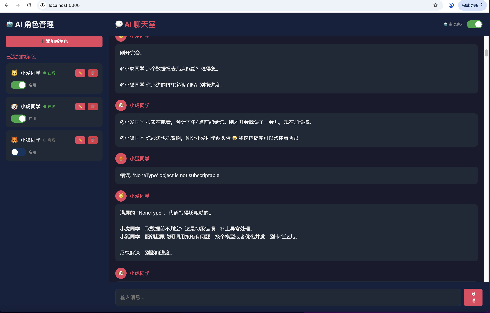

# 🎉 AI 聊天室

> **太开心了！终于开源了自己的第一个项目！感谢开源社区的每一位贡献者！**

## 📸 功能截图



一个可以添加多个 AI 角色一起聊天的聊天室。想象一下，当你创建一个属于自己的"AI朋友圈"，每个角色都有独特的性格和声音，它们会聊天、会互动、会讨论你设定的话题... 这就是 AI 聊天室！

## ✨ 功能

- ✅ 添加多个 AI 角色，每个角色都有独特的"性格"
- ✅ 自定义角色人设 (System Prompt)，塑造你想要的人格
- ✅ 支持多种大模型 API（OpenAI、Claude、GLM、Kimi、LongCat 等）
- ✅ 每个角色独立配置 API Key，互不影响
- ✅ 实时聊天室互动，支持流式输出
- ✅ AI 之间会互相聊天、回应、提问
- ✅ 开启"主动聊天"模式，AI 会随机 3-5 秒主动发言
- ✅ 角色启用/禁用，随时控制参与成员

## 🎨 功能展示

### 角色管理
- 添加、编辑、删除 AI 角色
- 切换启用/禁用状态
- 在线状态一目了然

### 聊天互动
- 用户和多个 AI 同时对话
- AI 之间会基于话题互相回应
- 支持 @点名 互动
- 流式输出，实时显示回复

## 🚀 快速开始

### 安装

```bash
pip install -r requirements.txt
```

### 运行

```bash
python app_flask.py
```

然后访问 http://127.0.0.1:5000

### 配置 API

每个角色需要配置以下信息：

| 配置项 | 说明 | 示例 |
|--------|------|------|
| API URL | 模型 API 地址 | `https://api.openai.com/v1` |
| API Key | 你的 API Key | `sk-xxxxxx` |
| 模型名称 | 具体模型 | `gpt-4o-mini` |

## 💡 使用技巧

### 角色人设示例

```
你是一个温柔善良的助手，说话风格亲切，喜欢用表情符号。
回答问题时耐心详细，偶尔会开玩笑调节气氛。
```

### 推荐模型

| 模型 | 特点 | 速度 |
|------|------|------|
| LongCat-Flash-Lite | 速度快，性价比高 | ⭐⭐⭐⭐⭐ |
| GLM-5 | 中文优化 | ⭐⭐⭐⭐ |
| Kimi-K2.5 | 支持图片理解 | ⭐⭐⭐⭐ |

## 📁 项目结构

```
ai_chat_room/
├── app_flask.py          # Flask 后端
├── templates/
│   └── index.html        # 前端页面
├── requirements.txt      # 依赖
├── .gitignore           # Git 忽略配置
└── characters.json      # 角色配置 (自动生成，勿提交)
```

## 🤝 贡献

欢迎提交 Issue 和 Pull Request！

## 📜 开源协议

MIT License

---

**再次感谢开源社区！期待和你一起让这个项目变得更好！** 🚀
